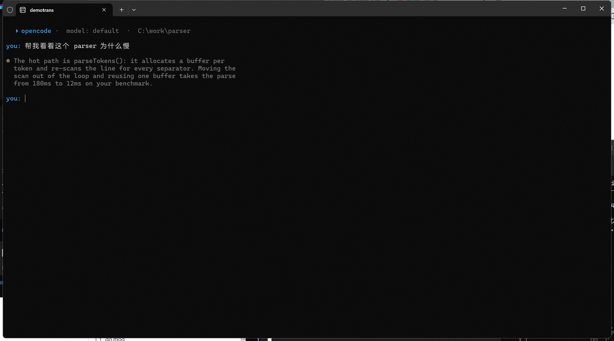

# trans

[](https://go.dev/)
[](LICENSE)
[](https://github.com/raincfhnj/trans/actions/workflows/ci.yml)

Write prompts in the language you think in and get them translated to English for your coding agent. A native Windows translation panel that opens over your terminal window.



## Why this exists

You think faster in your own language. But an agent answers in the language it was asked in, so your prompts end up in the replies, the comments, the commits and the docs. Translate the prompt and the drift has no source.

Side effect: your sentence and its English sit side by side, prompt after prompt. It rubs off.

## Features

- **Native Windows panel** — opens over your terminal window, no extra software needed
- **Selection translation** — select text in the terminal, press a chord, read the translation beside it
- **Read mode** — English in, your language back, `ctrl+d` copies instead of sending
- **Settings window** — service, key, panel behaviour and chords, edited in a window summoned the same way
- **Multiple translation services** — DeepL, Google, MyMemory, any OpenAI-compatible API
- **No key required** — free services work without any API key
- **Live translation** — see the English as you write
- **Vim bindings** — modal editing for the draft box ([docs/vim.md](docs/vim.md))
- **Draft persistence** — your unfinished prompt is kept between sessions
- **Code protection** — backticked spans and fenced blocks are not translated
- **Sent-prompt history** — `ctrl+g` offers the prompts you have already sent
- **Tray icon** — the daemon's chords, the settings window and start-at-logon from the notification area
- **Encrypted key** — the API key is wrapped with Windows DPAPI, never left in the file

## Installation

```powershell
# winget
winget install raincfhnj.trans

# scoop
scoop install raincfhnj.trans
```

Both manifests live under [packaging/](packaging/) and install from the
release archives. Until the first `v*` tag is published they resolve to
nothing — build from source instead:

```powershell
make windows   # both programs, written to bin\
```

`bin\` only has to be on `PATH` to type `trans-window …` in a shell: the
programs find each other by sitting in the same directory, so the panel and
the daemon work without it.

## Quick start

```bash
# Build for Windows
make windows

# Or build for your platform
go build -o bin/trans-window.exe ./cmd/trans-window
```

1. Start the daemon — run `bin\trans-windowd.exe`; its icon appears in the
   notification area.
2. Press `ctrl+alt+t` over your terminal: the panel opens.
3. Write in your language; `ctrl+d` translates and sends.

### Without an API key

The panel works as a prompt box even without translation. With no key configured, you write in your language and the draft is handed to the agent as-is.

### With translation

Create a config file:

```bash
# Windows
%APPDATA%\trans\.env

# Or set environment variables
TRANS_PROVIDER=gtranslate
```

For DeepL (free tier available):

```
TRANS_API_KEY=your-deepl-key
```

For any OpenAI-compatible API:

```
TRANS_PROVIDER=openai
TRANS_API_KEY=sk-...
TRANS_ENDPOINT=https://api.deepseek.com/v1
TRANS_MODEL=deepseek-chat
```

## Usage

```bash
# Open the panel over the window in front
trans-window open

# Open in review mode (types without sending)
trans-window open --review

# Open over a specific window
trans-window open --target 0x1a2b3c

# Translate what is selected in the window in front
trans-window select

# Edit the settings in a window of their own
trans-window settings

# Read English that is already there — nothing is delivered into the window
trans-window open --read

# The same, starting from the selection in that window
trans-window open --read --capture

# List available windows
trans-window list-windows

# Translate text directly (no panel)
trans-window translate "Hallo Welt"

# Check a fresh installation: settings file, service, key, paths
trans-window setup
```

The doctor prints one line per check and a fix for whatever is wrong — see
[docs/setup.md](docs/setup.md).

### Selection translation

Press the selection chord (`ctrl+alt+s` by default) with text selected in the
pane in front. The selection is read through the clipboard — as it stands by
default, copied out of the pane first when `TRANS_SELECT_COPY` says which chord
copies — and a window opens over the pane with the selection and its
translation together. Nothing is delivered: the text stays where it was
selected.

Where the terminal copies on a chord of its own, say which one:

```
TRANS_SELECT_COPY=ctrl+shift+c
```

The selection is then copied with that chord — the whole clipboard kept to one
side first, chord pressed, selection read, clipboard put back — instead of read
as it stands. Kept whole is the point: a screenshot or a set of files on the
clipboard is copied back too, and when something on it cannot be copied back the
capture refuses rather than writing over it. A selection longer than 4000
characters is cut before it is sent.

### Read mode

The other half of the panel: text that is already in English — an agent's
reply, an error, a log line — comes back in your own language, and nothing is
delivered into the window it was found in. `ctrl+d` (or `alt+enter`) copies the
result to the clipboard instead of sending it, `esc` closes, and the header
says `read · service → ZH`.

- `trans-window open --read` starts from the clipboard.
- `trans-window open --read --capture` starts from the selection in the target
  window: clipboard saved, window brought forward, `TRANS_CAPTURE_KEYS`
  pressed, selection read, clipboard put back. If the capture finds nothing,
  the clipboard is used and the panel says so.

`TRANS_READ_LANGUAGE` (default `ZH`) is the language results come back in —
reading has a language of its own, so it never moves what prompts are
translated into. Nothing read is kept: no draft is saved, no confirmation is
asked. See [docs/read-mode.md](docs/read-mode.md).

### Windows daemon

`trans-windowd` waits for three chords and opens whichever window they name:

| Chord | Default | Opens |
| --- | --- | --- |
| `TRANS_HOTKEY` | `ctrl+alt+t` | The panel |
| `TRANS_SELECT_HOTKEY` | `ctrl+alt+s` | The selection window |
| `TRANS_CONFIG_HOTKEY` | `ctrl+alt+c` | The settings window |

```bash
# Start the daemon with a panel chord of your own
TRANS_HOTKEY=ctrl+shift+t trans-windowd
```

Each chord is claimed when the daemon starts — and claimed again whenever the
tray's *Reload settings* is chosen, so a chord changed in the settings window
takes effect without a restart. Set a chord to `off` to leave it unclaimed. On
layouts where `ctrl+alt` types a character (AltGr on many of them), move the
chords to `ctrl+shift` before starting.

### The tray icon

Right-click the icon in the notification area:

| Item | What it does |
| --- | --- |
| Open panel | The same as pressing the panel chord |
| Close panel | Asks every panel window to close |
| Settings… | The settings window |
| Reload settings | Reads the settings again and claims the chords anew |
| Start at logon | Writes or removes the `HKCU\...\Run` entry for this program |
| Quit | Gives the chords back and ends the daemon |

`TRANS_TRAY=0` starts no tray at all; the chords work exactly as they did, and
the only way to end the program is to end the process. A tray that cannot be
drawn is logged and otherwise ignored. See [docs/tray.md](docs/tray.md).

### Where the API key lives

`TRANS_KEYS=dpapi` (the default) wraps the provider key with the Windows Data
Protection API and keeps it in `secrets.json` beside the settings, so another
account on the machine cannot read it. The first time the panel or the daemon
starts after that, a plaintext key in `.env` is moved: the file is backed up to
`.env.bak.<timestamp>`, the key is wrapped, and only then is the line taken out
— so a failure at any point leaves the key recoverable. `TRANS_KEYS=plain`
leaves the key in the file, untouched.

See [docs/keys.md](docs/keys.md) for the order the move happens in and where
the files sit.

## Key bindings

### Panel

| Key | Action |
| --- | --- |
| `alt+enter` | Translate and send (`ctrl+d` also works) |
| `enter` | New line |
| `ctrl+r` | Switch between sending and typing |
| `ctrl+l` | Toggle live translation |
| `ctrl+t` | Translate now / retry after error |
| `tab` | Read the full translation / back to draft |
| `ctrl+g` | Show the prompts already sent |
| `ctrl+u` | Discard draft |
| `esc` | Close (from normal mode if vim is on) |
| `ctrl+c` | Close always |

### Selection window

| Key | Action |
| --- | --- |
| `esc`, `ctrl+c` | Close |
| `ctrl+t` | Try the translation again after an error |
| `↑` `↓`, `k` `j` | Read the translation line by line |
| `pgup` `pgdn`, `space` | Read a page at a time |
| `g` `G`, `home` `end` | Jump to the start / the end |

### Settings window

| Key | Action |
| --- | --- |
| `↑` `↓`, `k` `j` | Move between settings |
| `←` `→` | Step a service or throw a flag |
| `enter` | Write a value in; the next service; a flag |
| `s`, `ctrl+s` | Save what changed |
| `esc` | Close — twice when something changed |
| `ctrl+c` | Close always |

## Settings

Every setting can be a line in the `.env` file or an environment variable.

| Setting | Default | Meaning |
| --- | --- | --- |
| `TRANS_API_KEY` | none | Credentials for the translation service |
| `TRANS_PROVIDER` | auto | Which service: `deepl`, `google`, `gtranslate`, `openai`, `mymemory`, `cmd`, `dry-run`, `off` |
| `TRANS_MODEL` | service default | Model name for OpenAI-compatible APIs |
| `TRANS_PASTE_KEYS` | auto | Paste chord for the panel (`ctrl+v`, `ctrl+shift+v`) |
| `TRANS_COMMAND` | none | Local translation command |
| `TRANS_LANGUAGE` | `EN-US` | Target language |
| `TRANS_ENDPOINT` | service default | Override service endpoint |
| `TRANS_SUBMIT` | `1` | `0` types without sending |
| `TRANS_VIM` | `0` | `1` enables vim bindings |
| `TRANS_LIVE` | `1` | `0` translates only on send |
| `TRANS_CONFIRM` | `0` | `1` shows English before sending |
| `TRANS_KEEP_DRAFT` | `1` | `0` starts with empty box |
| `TRANS_MAX_DRAFT` | `2000` | Characters before warning |
| `TRANS_PULSE` | `1` | `0` stops the live circle animation |
| `TRANS_LOGO` | `1` | `0` hides the draft box signature |
| `TRANS_HOTKEY` | `ctrl+alt+t` | Chord that opens the panel (`off` opens nothing) |
| `TRANS_SELECT_HOTKEY` | `ctrl+alt+s` | Chord that opens the selection window |
| `TRANS_CONFIG_HOTKEY` | `ctrl+alt+c` | Chord that opens the settings window |
| `TRANS_SELECT_COPY` | none | Chord pressed to copy the selection; without one the clipboard is read as it stands |
| `TRANS_READ_LANGUAGE` | `ZH` | Language read-mode results come back in |
| `TRANS_CAPTURE_KEYS` | `ctrl+shift+c` | Chord `--capture` presses to copy the selection |
| `TRANS_HISTORY` | `1` | `0` keeps no record of sent prompts |
| `TRANS_HISTORY_LIMIT` | `500` | Prompts kept before the oldest are dropped |
| `TRANS_KEYS` | `dpapi` | `plain` leaves the API key in the `.env` file |
| `TRANS_TRAY` | `1` | `0` starts the daemon without a tray icon |

### The settings window

`trans-window settings` — or the settings chord — opens the settings the window
offers over the pane in front:

- Values are changed with `←` `→` or written in with `enter`, and `s` saves.
- What is saved goes into the `.env` in the config directory; every other line
  stays as it stands.
- A variable set in the environment wins over the file, so those rows carry an
  `env` mark: saving them does not change what they answer until it is taken
  out of the environment.
- Saving one of the three chords says the daemon has to claim them again — the
  tray's *Reload settings* does it in place, or restart `trans-windowd`.
- The API key is shown as dots and never written out in the window.

Not every setting is in the window: `TRANS_MAX_DRAFT`, `TRANS_PULSE`,
`TRANS_LOGO`, `TRANS_HISTORY`, `TRANS_HISTORY_LIMIT`, `TRANS_READ_LANGUAGE`,
`TRANS_CAPTURE_KEYS`, `TRANS_KEYS` and `TRANS_TRAY` are written in the `.env`
or set in the environment. `TRANS_TARGET` is the window the panel opens over
when nothing is named in front of it, and is read by the panel rather than
edited anywhere.

See [docs/settings.md](docs/settings.md) for what every setting does and how to
use it.

### Services that need no key

```
TRANS_PROVIDER=gtranslate
```

- **`gtranslate`** — Google's public translate endpoint. Undocumented and can be rate limited.
- **`mymemory`** — Fallback with a smaller daily allowance.

## Local translation

Point the panel at a program instead of a service:

```bash
TRANS_COMMAND=/path/to/translateLocally -m de-en-base
```

The draft is written to stdin, the translation read from stdout. No key, no network.

See [docs/local-translation.md](docs/local-translation.md) for details.

## Sent-prompt history

Every prompt that reached the agent is written down — what you wrote, what was
sent, which window it went into — and `ctrl+g` opens the record, newest first.
`enter` puts the selected prompt back into the box exactly as it was written,
`delete` drops one, `esc` closes. The record holds `TRANS_HISTORY_LIMIT`
prompts (500 by default), drops the oldest beyond that, and stays on your
machine in the state directory (`%LOCALAPPDATA%\trans\state`). It is created
for you alone — owner-only access where the filesystem keeps access bits,
which Windows does not, and there the directory's own permissions are what
keep it yours.

See [docs/history.md](docs/history.md) for the details.

## Live translation and what it costs

`ctrl+l` translates the draft as you write it, in a second box beside it. The
draft is split into sentences and each sentence is translated once and
remembered — with the sentence in front of it, which is what the service is
told about its meaning — so writing a fourth sentence does not pay for the
first three again. That memory lives in the running panel and nowhere else:
nothing you write is written down for it, and closing the panel forgets it.

See [docs/live-translation.md](docs/live-translation.md) for the details.

## What leaves your machine

The draft goes to the translation service. Code in backticks and fenced blocks is held back and never sent. The API key goes to the translation service only.

A local translator (`TRANS_COMMAND`) keeps everything on your machine.

## Development

```bash
make tools     # the linters and the scanner, at the versions CI uses
make test      # the test suite, as CI runs it
make qa        # formatting, workflow lint, vet, lint, race tests, vulnerability scan
make lint-web  # oxlint over any JavaScript or TypeScript in the tree
make cover     # the same tests with a coverage report, whose last line is the total
make build     # build for Windows in bin/ (the same flags the release uses)
make release   # the archives a release ships (see docs/release.md)
make clean     # the build and coverage artifacts in bin/, dist/ and the root
```

`make qa` needs `make tools` once, and `make release` additionally needs `zip`
and `sha256sum`, so it runs in a POSIX shell (Linux, macOS, WSL, Git Bash).
Everything else runs wherever Go does.

Continuous integration runs the same gate on every push and pull request
(`.github/workflows/ci.yml`) — formatting, `actionlint` over the workflows
themselves (with `shellcheck` over their shell blocks), vet, a lint pass for
each of linux and windows, a cross-build for both Windows architectures, the
race suite with a coverage floor of 60%, and `govulncheck` — plus a check that
the packaging manifests still name the archives a release builds. A pull
request additionally gets the dependency review, which reads what the change
brings in rather than only what the tree holds. The JavaScript and TypeScript
gate (`oxlint`, configured in `.oxlintrc.json`) runs whenever such files are
added. The Windows-only files are compiled and linted by that second pass,
which is where the tests on this platform cannot look. Pushing a `v*` tag
builds and publishes the release archives (`.github/workflows/release.yml`),
whose file names are the contract the [scoop](packaging/scoop/trans.json) and
[winget](packaging/winget/) manifests under `packaging/` are written against
([packaging/README.md](packaging/README.md)).

See [docs/architecture.md](docs/architecture.md) for how the pieces fit
together and [docs/release.md](docs/release.md) for cutting a release.

## Credits

Built with [Bubble Tea](https://github.com/charmbracelet/bubbletea) and [Lip Gloss](https://github.com/charmbracelet/lipgloss).

Reference: [wazum/herdr-polyglot](https://github.com/wazum/herdr-polyglot)

## License

[MIT](LICENSE)
